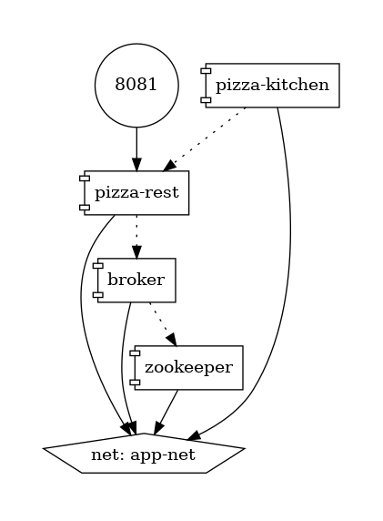

# Pizza

Приложение (pizza-rest) позволяет создать заказ из предзагруженных пицц (http://localhost:8081/pizzas).

Чтобы создать заказ, требуется отправить id выбранных пицц (http://localhost:8081/api/orders),
есть возможность заменить пиццы в заказе (примеры есть в postman).

После подтверждения заказа (http://localhost:8081/api/orders/confirm), данные о заказе отправляются в topic Kafka
в формате JSON.

Другое приложение (pizza-kitchen) слушает topic, логирует информацию о пиццах при получении, а после отправляет
в другой topic, который уже слушает (pizza-rest).

pizza-rest также логирует информацию о пиццах.

## pizza-rest

REST API для:
- создание заказа (POST) http://localhost:8081/api/orders
- изменение заказа (PUT) http://localhost:8081/api/orders
- удаление (DELETE) http://localhost:8081/api/orders
- подтверждение заказа (POST) http://localhost:8081/api/orders/confirm

Используется DTO - OrderModel

После подтверждения заказ отправляется в Kafka (topic kitchen)

Слушатель Kafka для готовых заказов (topic ready)

## pizza-kitchen

Слушает заказы из Kafka (topic kitchen)

Отправляет "готовый" (нет доп. логики) заказ в Kafka (topic ready)

P.S. название топиков можно сконфигурировать через переменные, kitchen изменен на super-kitchen в docker-compose.yml 

## Run

Оба приложения упакованы в образы и хранятся на Docker Hub.

Позволяет запустить приложения вместе с Kafka. В логах контейнерах можно наблюдать
успешный запуск Kafka. А также информацию о пиццах, при подтверждении заказа. (запросы с локального postman работают)
```sh
docker compose up -d
```




Либо можно запустить Kafka отдельно, при помощи
```sh
docker compose -f docker-compose-kafka.yml up
```
и `PizzaRestApplication`, `KitchenApplication` через IDE

## TODO

- Dependency and Health checks
- Tests
- Admin module (Thymeleaf)
- Security
- pizza-app