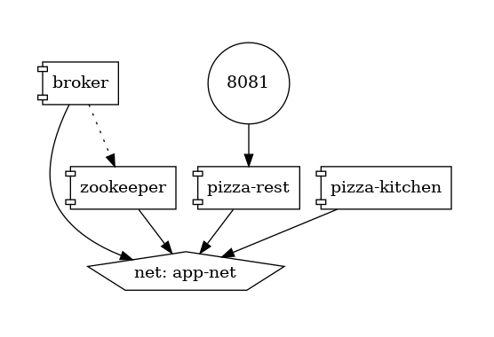

# Pizza

## pizza-rest

REST API для:
- создание заказа (POST)
- изменение заказа (PATCH)
- удаление
- подтверждение заказа (POST)

Используется DTO - OrderModel

После подтверждения заказ отправляется в Kafka (topic kitchen)

Слушатель Kafka для готовых заказов (topic ready)

## pizza-kitchen

Слушает заказы из Kafka (topic kitchen)

Отправляет "готовый" (нет доп. логики) заказ в Kafka (topic ready)

P.S. название топиков можно сконфигурировать через переменные, kitchen изменен на super-kitchen в docker-compose.yml 

## Dev

```sh
docker compose up -d
```



Локальный Kafka
```shell
docker compose -f .\docker-compose-kafka.yml up -d 
```

## TODO

Dependency and Health checks